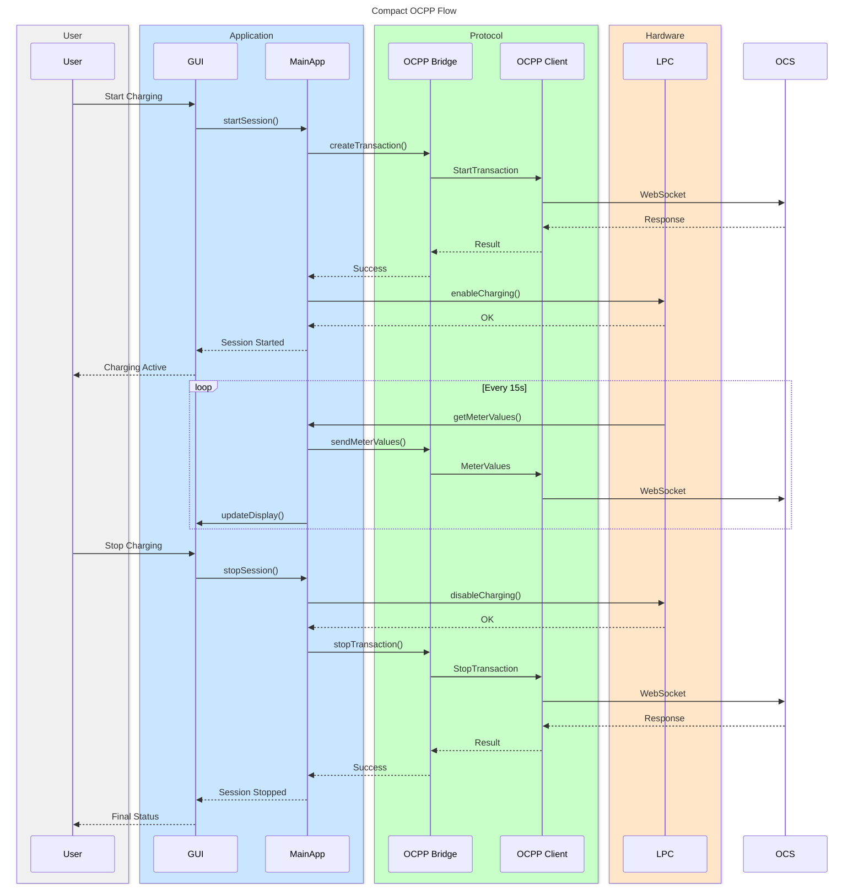

```mermaid
---
title: Compact OCPP Flow
---
sequenceDiagram
    box rgb(240,240,240) User
    participant U as User
    end
    
    box rgb(200,230,255) Application
    participant G as GUI
    participant M as MainApp
    end
    
    box rgb(200,255,200) Protocol
    participant B as OCPP Bridge
    participant C as OCPP Client
    end
    
    box rgb(255,230,200) Hardware
    participant L as LPC
    end
    
    U->>G: Start Charging
    G->>M: startSession()
    M->>B: createTransaction()
    B->>C: StartTransaction
    C->>OCS: WebSocket
    OCS-->>C: Response
    C-->>B: Result
    B-->>M: Success
    M->>L: enableCharging()
    L-->>M: OK
    M-->>G: Session Started
    G-->>U: Charging Active
    
    loop Every 15s
        L->>M: getMeterValues()
        M->>B: sendMeterValues()
        B->>C: MeterValues
        C->>OCS: WebSocket
        M->>G: updateDisplay()
    end
    
    U->>G: Stop Charging
    G->>M: stopSession()
    M->>L: disableCharging()
    L-->>M: OK
    M->>B: stopTransaction()
    B->>C: StopTransaction
    C->>OCS: WebSocket
    OCS-->>C: Response
    C-->>B: Result
    B-->>M: Success
    M-->>G: Session Stopped
    G-->>U: Final Status

```
