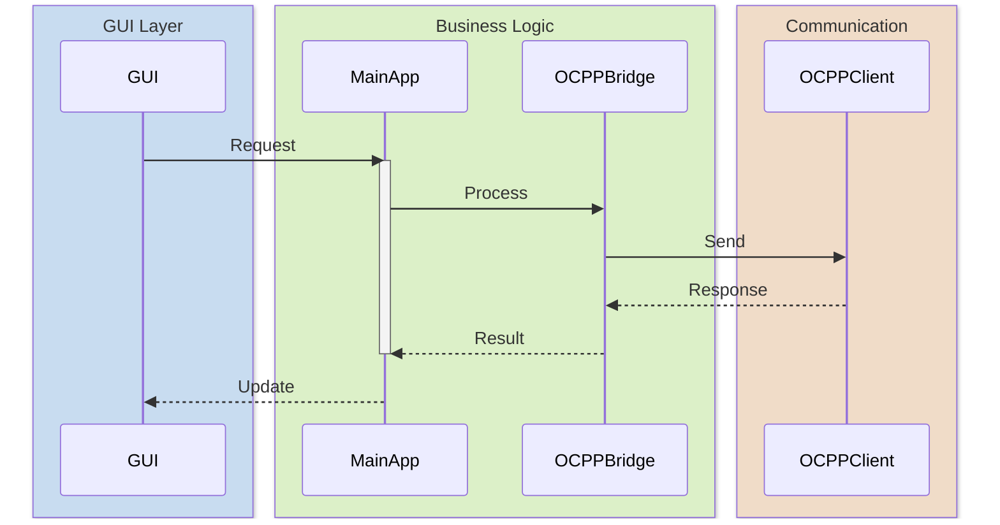

---
title:
---

```mermaid
sequenceDiagram
    box rgb(200,220,240) GUI Layer
    participant GUI
    end
    box rgb(220,240,200) Business Logic
    participant MainApp
    participant OCPPBridge
    end
    box rgb(240,220,200) Communication
    participant OCPPClient
    end
    
    GUI->>MainApp: Request
    activate MainApp
    MainApp->>OCPPBridge: Process
    OCPPBridge->>OCPPClient: Send
    OCPPClient-->>OCPPBridge: Response
    OCPPBridge-->>MainApp: Result
    deactivate MainApp
    MainApp-->>GUI: Update

```
