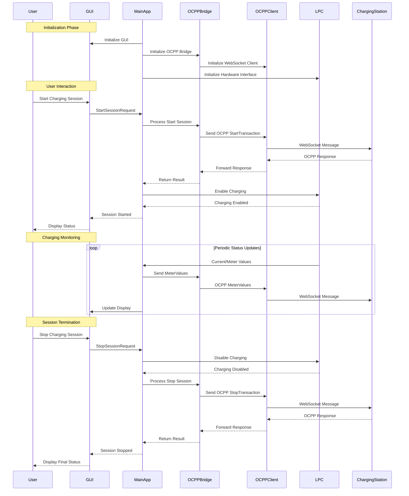

---
title:
---

```mermaid

sequenceDiagram
    participant User
    participant GUI
    participant MainApp
    participant OCPPBridge
    participant OCPPClient
    participant LPC
    participant ChargingStation

    Note over User,GUI: Initialization Phase
    MainApp->>GUI: Initialize GUI
    MainApp->>OCPPBridge: Initialize OCPP Bridge
    OCPPBridge->>OCPPClient: Initialize WebSocket Client
    MainApp->>LPC: Initialize Hardware Interface
    
    Note over User,GUI: User Interaction
    User->>GUI: Start Charging Session
    GUI->>MainApp: StartSessionRequest
    MainApp->>OCPPBridge: Process Start Session
    OCPPBridge->>OCPPClient: Send OCPP StartTransaction
    OCPPClient->>ChargingStation: WebSocket Message
    ChargingStation-->>OCPPClient: OCPP Response
    OCPPClient-->>OCPPBridge: Forward Response
    OCPPBridge-->>MainApp: Return Result
    MainApp->>LPC: Enable Charging
    LPC-->>MainApp: Charging Enabled
    MainApp-->>GUI: Session Started
    GUI-->>User: Display Status
    
    Note over User,GUI: Charging Monitoring
    loop Periodic Status Updates
        LPC->>MainApp: Current/Meter Values
        MainApp->>OCPPBridge: Send MeterValues
        OCPPBridge->>OCPPClient: OCPP MeterValues
        OCPPClient->>ChargingStation: WebSocket Message
        MainApp->>GUI: Update Display
    end
    
    Note over User,GUI: Session Termination
    User->>GUI: Stop Charging Session
    GUI->>MainApp: StopSessionRequest
    MainApp->>LPC: Disable Charging
    LPC-->>MainApp: Charging Disabled
    MainApp->>OCPPBridge: Process Stop Session
    OCPPBridge->>OCPPClient: Send OCPP StopTransaction
    OCPPClient->>ChargingStation: WebSocket Message
    ChargingStation-->>OCPPClient: OCPP Response
    OCPPClient-->>OCPPBridge: Forward Response
    OCPPBridge-->>MainApp: Return Result
    MainApp-->>GUI: Session Stopped
    GUI-->>User: Display Final Status


```
