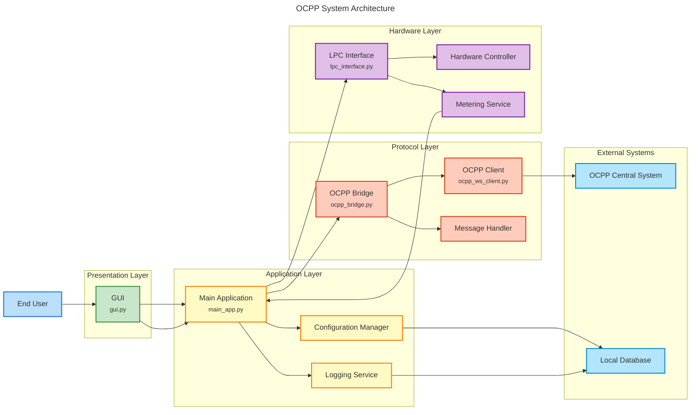

```mermaid
---
title: OCPP System Architecture
---
graph LR
    %% Define nodes
    User["End User"]
    
    subgraph "Presentation Layer"
        GUI["GUI<br/><small>gui.py</small>"]
    end
    
    subgraph "Application Layer"
        MainApp["Main Application<br/><small>main_app.py</small>"]
        Config["Configuration Manager"]
        Logging["Logging Service"]
    end
    
    subgraph "Protocol Layer"
        OCPPBridge["OCPP Bridge<br/><small>ocpp_bridge.py</small>"]
        OCPPClient["OCPP Client<br/><small>ocpp_ws_client.py</small>"]
        MessageHandler["Message Handler"]
    end
    
    subgraph "Hardware Layer"
        LPC["LPC Interface<br/><small>lpc_interface.py</small>"]
        HardwareCtrl["Hardware Controller"]
        Metering["Metering Service"]
    end
    
    subgraph "External Systems"
        OCPPServer["OCPP Central System"]
        Database["Local Database"]
    end
    
    %% Define connections
    User --> GUI
    GUI --> MainApp
    GUI --> MainApp
    
    MainApp --> OCPPBridge
    MainApp --> LPC
    MainApp --> Config
    MainApp --> Logging
    
    OCPPBridge --> OCPPClient
    OCPPBridge --> MessageHandler
    
    OCPPClient --> OCPPServer
    
    LPC --> HardwareCtrl
    LPC --> Metering
    Metering --> MainApp
    
    Config --> Database
    Logging --> Database
    
    %% Styling without JavaScript
    classDef user fill:#bbdefb,stroke:#1976d2,stroke-width:2px
    classDef presentation fill:#c8e6c9,stroke:#388e3c,stroke-width:2px
    classDef application fill:#fff9c4,stroke:#f57c00,stroke-width:2px
    classDef protocol fill:#ffccbc,stroke:#d84315,stroke-width:2px
    classDef hardware fill:#e1bee7,stroke:#7b1fa2,stroke-width:2px
    classDef external fill:#b3e5fc,stroke:#0288d1,stroke-width:2px
    
    class User user
    class GUI presentation
    class MainApp,Config,Logging application
    class OCPPBridge,OCPPClient,MessageHandler protocol
    class LPC,HardwareCtrl,Metering hardware
    class OCPPServer,Database external

```
