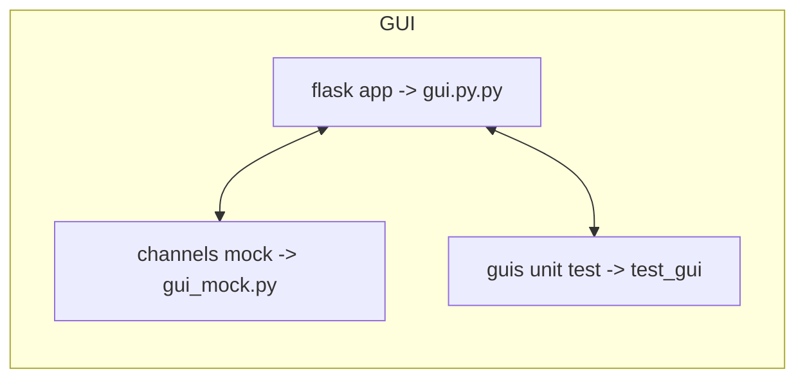
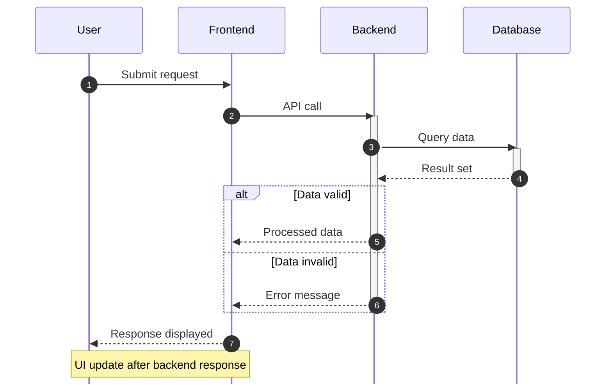

تمام آنچه تا اینجا نوشته شده است قرار است تغییر کند. این داکیومنت به صورت روزانه آپدیت می‌شود. به معماری decentralized مهاجرت خواهیم کرد.
در این روش دستور ها در کانال‌های خودشان منتشر می‌شوند و تمام میکروسرویس‌‌ها دستور‌هارا در کانال خودشان دریافت می‌کنند.
ENVS is okay for boot-time defaults, but runtime values should come from MQTT/state topics.
Y best architecture is actually:

gs.charge_status → hardware truth
gs.phase → app flow override / backend interaction phase
resolve_display_phase(gs) → final UI phase to emit

[[Channels List| لیست کانال‌های استفاده شده]] 
[[لیست تاپیک‌ها بررسی شده]]
[[لیست تاپیک ها و پابلیش و سابسکرایب]]
را مطالعه کنید. به طور مرتب آپدیت می‌شود.
[[Tools used in this project| ابزارهای مورد نیاز  و استفاده شده ]]
 نیز به طور مرتب با آموزش‌های مورد نیاز یادداشت می‌شوند.
 [[1405-01-12|امروز]]
 
 [[1405-01-18| ۱۷ ۱۸ فروردین]]___
 How I manually set up a dc evck orangepi commands
 [[manuall commands]]

تنظیم گیت هاب لوکال روی شرکت [[گیت هاب لوکال]]
[[لیست مباحث]]
[[ال پی سی تست با سریال لوکال]]
[[معماری جدید کانفیگ منیجر چطوری کار میکند]]

[[منطق توسعه هلث چک، برای اینکه بتونم دستگاهی رو تنظیم کنم از راه دور یا دیاگنوس کنم.]]
[[installation commands]]
[[vim]]
[[terminal resize]]
[[git]]
ــــــــــــ
 
برای اینکه فراموش نکنیم کدوم بخش از برنامه چطور داره کار میکنه و در توسعه مقیاس بزرگ دچار مشکل نشیم باید گزارش‌هایی داشته باشیم و بخش‌‌های مختلف مکتوب بشن.
تعیین [[اصول طراحی]] مناسب میتونه مهم ترین بخش این پروژه باشه.

همچنین توضیح [[جریان کار]] در شارژرها می‌تواند به عنوان  مرجع در نظر گرفته شود. 
و [[چالش‌ها]] که باهاشون مواجه هستیم شرح داده شدن.
___
From now on, we have decided to write a **decentralized** app, 

so as a result we will remove the orchestrator, publish each command on a specific redis channel and each unit catch the command and calculate it's needed data.
we will test each unit with a mock and unit tests, and write this new app one module at a time.

GUI
LPC
OCPP

like for the gui
if the start command comes from the commands channel, 