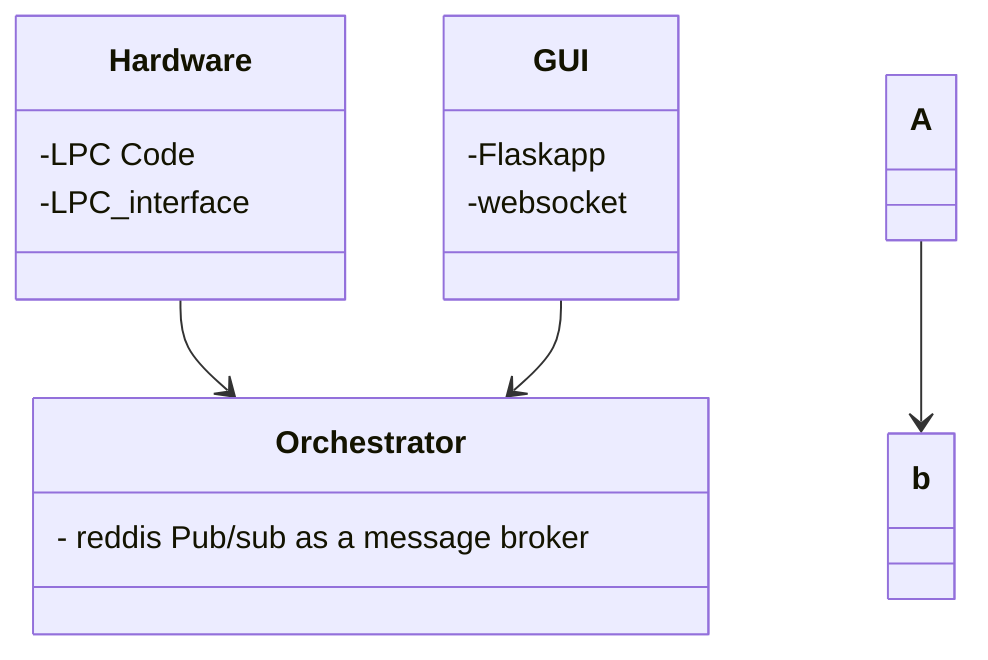

```mermaid
classDiagram
	-vertical 
	class Hardware{
		-LPC Code
		-LPC_interface
		}
		
	class GUI{
		-Flaskapp
		-websocket
		}
	class Orchestrator{
		- reddis Pub/sub as a message broker
	}
		
	Hardware --> Orchestrator
	GUI --> Orchestrator
	
flowchart TD
 A --> b
```