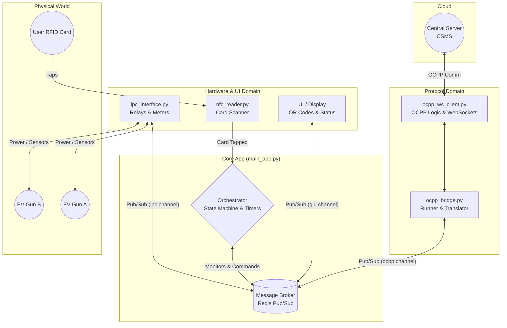
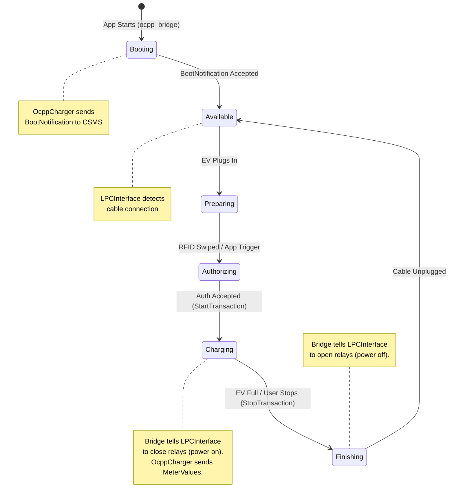

# GUI
[[How GUI is working| رابط گرافیکی کاربر چطوری کار میکند؟]]
[[How CSMS server client is working | ارتباط با سرور چطور کار می‌کند؟]]
## Component architecture

## Charging Session State Diagram

# LPC
# OCPP
